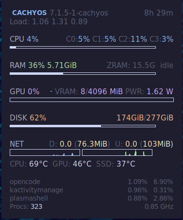

# Compact CachyOS Conky

> A vertically **compact**, Catppuccin-themed Conky dashboard for **CachyOS** (and Arch Linux). Every section uses a clean 2-line pattern — labels and values on line 1, a progress bar on line 2. Includes **NVIDIA GPU metrics** (utilization bar, VRAM, power draw), **ZRAM compression stats**, and **live sensor temperatures**.



## Highlights

| Section | What it shows |
|---|---|
| **Header** | CachyOS branding, kernel version, uptime |
| **CPU** | Total + per-core utilization (up to 4 cores), live bar |
| **RAM + ZRAM** | Memory used/percent, ZRAM device size + compression ratio, live bar |
| **GPU** | Utilization bar, VRAM usage, power draw — all from `nvidia-smi` |
| **DISK** | Root partition usage, live bar |
| **NET** | Download/upload speeds + cumulative totals, dual sparkline graphs |
| **Temperatures** | CPU / GPU / SSD — inline, no separate section |
| **Processes** | Top 3 by CPU usage + process count + CPU frequency |

## Requirements

| Package | Purpose |
|---|---|
| `conky-lua-nvidia` | Conky with Lua + NVIDIA support |
| `lm_sensors` | CPU/SSD temperature reading |
| `nvidia-smi` (part of `nvidia-utils`) | GPU metrics |
| `bc` | ZRAM compression ratio calculation |

Install on CachyOS / Arch:

```bash
sudo pacman -S conky-lua-nvidia lm_sensors nvidia-utils bc
```

## Quick Start

```bash
# Clone and enter
git clone https://github.com/CliffVale/compact-cachyos-conky.git
cd compact-cachyos-conky

# Install config
mkdir -p ~/.config/conky ~/.local/bin
cp conky.conf ~/.config/conky/

# Install helper scripts
cp gpu-util zram-stats ~/.local/bin/
chmod +x ~/.local/bin/gpu-util ~/.local/bin/zram-stats

# Launch
conky -c ~/.config/conky/conky.conf -d
```

### Autostart (KDE Plasma)

Add `conky -c ~/.config/conky/conky.conf -d` to:
- **System Settings → Startup and Shutdown → Autostart** → Add script
- Or create `~/.config/autostart/conky.desktop`:

```ini
[Desktop Entry]
Type=Application
Name=Conky
Exec=conky -c /home/$(USER)/.config/conky/conky.conf -d
StartupNotify=false
X-KDE-autostart-phase=2
```

## Layout

```
CACHYOS 7.1.5-1-cachyos                  1h 32m
Load: 0.34 0.84 1.25

CPU 3%            C0:6% C1:4% C2:3% C3:3%
████████░░░░░░░░░░░░░░

RAM 35% 5.48GiB             ZRAM: 15.5G idle
████████████░░░░░░░░░░

GPU 0% · VRAM: 8/4096 MiB · PWR: 1.68 W
░░░░░░░░░░░░░░░░░░░░░░

DISK 62%                          173GiB/277GiB
████████████████████░░

NET   D: 1.5K (72.4MiB)  U: 1.4K (99.0MiB)
[graph] [graph]

CPU: 53°C  GPU: 44°C  SSD: 39°C

opencode         12%   8%
kwin_waylight     5%   3%
floorp            3%   2%
Procs: 318                     4.30 GHz
```

## Customization

### Change widget width

The config is tuned for **270px** — enough to fit double-digit CPU/core values without overlap. Adjust in `conky.conf`:

```lua
minimum_width = 270,
maximum_width = 270,
```

### Adjust colors

Built-in Catppuccin Mocha palette, used as Conky's indexed color variables:

| Variable | Hex | Usage |
|---|---|---|
| `default_color` | `#cdd6f4` | Base text |
| `color1` | `#89b4fa` | CPU / blue accent |
| `color2` | `#a6e3a1` | RAM / green accent |
| `color3` | `#cba6f7` | GPU / purple accent |
| `color4` | `#f9e2af` | NET / yellow accent |
| `color5` | `#a6adc8` | Section labels |
| `color6` | `#fab387` | DISK / orange accent |
| `color7` | `#f38ba8` | Red accent (unused by default) |
| `#585b70` | inline | Dim / secondary text |

### Set your network interface

Replace `wlan0` with your interface (`ip link` to list):

```
${downspeedf wlan0}   →   ${downspeedf eth0}
${upspeedf wlan0}     →   ${upspeedf eth0}
```

### Adapt for AMD / Intel GPU

The GPU section uses `nvidia-smi`. For other GPUs, replace the exec calls:

- **AMD:** `cat /sys/class/drm/card*/device/gpu_busy_percent`
- **Intel:** `intel_gpu_top` or `cat /sys/class/drm/card*/gt_cur_freq_mhz`

### Sensor paths may differ

Run `sensors` to find your temperature labels, then update the `exec sensors ...` lines in `conky.conf`.

## Files

```
compact-cachyos-conky/
├── conky.conf           # Main Conky configuration
├── gpu-util             # GPU utilization script (feeds execibar)
├── zram-stats           # ZRAM compression stats script
├── screenshot.png       # Live preview
├── LICENSE              # MIT
└── README.md            # This file
```

## Tips

- **Wayland (KDE):** The config uses `own_window_type = 'normal'` with `below` hint for desktop-only visibility. If using X11, you can switch back to `'override'` or `'desktop'` for better compositor support.
- **°C encoding:** If you see garbled degree symbols, ensure `override_utf8_locale = true` is set (it is).
- **Bar widths:** All bars are **240px** at the default 270px widget width. If you resize the widget, update the bar widths proportionally.

## License

MIT
